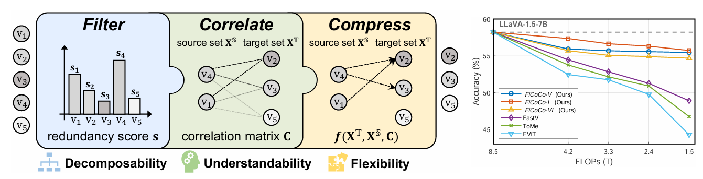
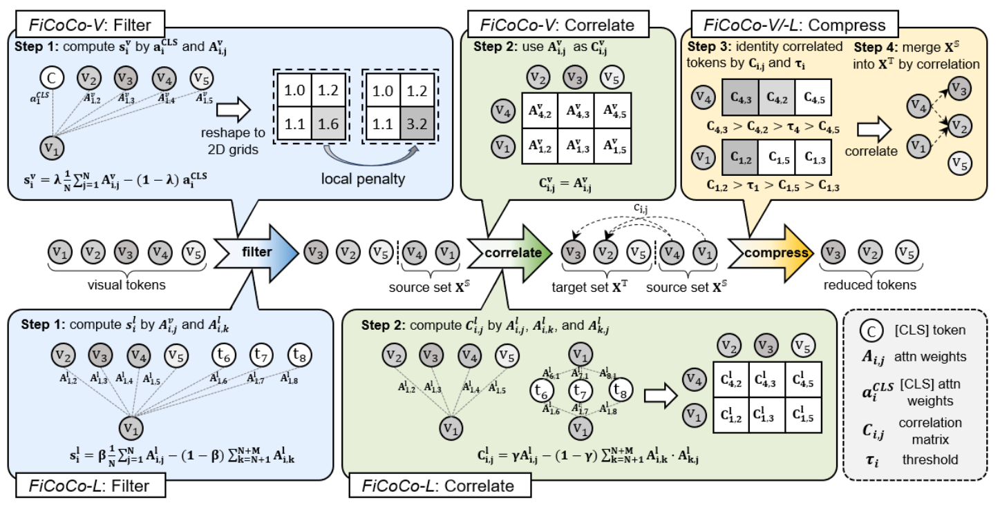

<div align="center">

<h1> Rethinking Token Reduction in MLLMs:
 Towards a Unified Paradigm for Training-Free Acceleration </h1>

<h4 align="center"> 

[Yuhang Han](https://scholar.google.com/citations?user=zggQZNAAAAAJ)<sup>1* </sup>,
[Xuyang Liu](https://xuyang-liu16.github.io/)<sup>2*</sup>,
[Pengxiang Ding](https://dingpx.github.io/)<sup>3</sup>,
[Donglin Wang](https://milab.westlake.edu.cn/)<sup>3</sup>,\
[Honggang Chen](https://sites.google.com/view/honggangchen/)<sup>2</sup>,
[QingSen Yan](https://qingsenyangit.github.io/)<sup>1</sup>
[Siteng Huang](https://kyonhuang.top/)<sup>4✉</sup>

<sup>1</sup>Northwestern Polytechnical University, <sup>2</sup>Sichuan University,\
<sup>3</sup>Westlake University, <sup>4</sup>Zhejiang University

<p>
<a href='https://arxiv.org/pdf/2411.17686'></a>
<a href='https://ficoco-accelerate.github.io/'></a>

</h4>
</div>

<p align='center'>

</p>

## 👀 Overview

To accelerate the inference of heavy Multimodal Large Language Models (MLLMs), this study rethinks the current landscape of training-free token reduction research. We regret to find that the critical components of existing methods are tightly intertwined, with their interconnections and effects remaining unclear for comparison, transfer, and expansion. Therefore, we propose a unified ''filter-correlate-compress'' paradigm that decomposes the token reduction into three distinct stages within a pipeline, maintaining consistent design objectives and elements while allowing for unique implementations. We additionally demystify the popular works and subsume them into our paradigm to showcase its universality. Finally, we offer a suite of methods grounded in the paradigm, striking a balance between speed and accuracy throughout different phases of the inference. Experimental results across 10 benchmarks indicate that our methods can achieve up to an 82.4% reduction in FLOPs with a minimal impact on performance, simultaneously surpassing state-of-the-art training-free methods.
<div align=center>

</div>

## 🛠 Preparation

1. Clone this repository.
```bash
git clone https://github.com/kawhiiiileo/FiCoCo.git
cd FiCoCo
```

2. Environment Setup and Preparation
```Shell
 conda create -n FiCoCo python=3.10 -y
 conda activate FiCoCo
 pip install -e .
```

3. Download Multimodal Benchmark

Please follow the detailed instruction in [LLaVA-Evaluation](https://github.com/haotian-liu/LLaVA/blob/main/docs/Evaluation.md).

4. Download LLaVA models and put them under ./liuhaotian/llava-v1.5-7b.

* [LLaVA-1.5](https://huggingface.co/liuhaotian/llava-v1.5-7b)

## 🚀 Run and evaluation
To configure the FiCoCo model with these parameters, update the corresponding settings in your code or configuration file. Below is an example configuration:

For example:\
`merge_visual: true`       # Enable FiCoCo-V for visual tokens compression\
`AT: true`                 # Enable FiCoCo-L for visual tokens compression\
`r: 42`                    # Compress 42 tokens per layer\
`control_encoding_layer: 11`  # Start compression from the 12th transformer layer

Example for evaluating SQA results (r=42, control_encoding_layer=11, merge_visual=True):
```Shell
CUDA_VISIBLE_DEVICES=0 bash scripts/v1_5/eval/sqa.sh
```

To calculate FLOPs, we can refer to the methodology presented in the work of [LLM-viewer](https://github.com/hahnyuan/LLM-Viewer/). We deeply appreciate their outstanding contribution to this field.


## 📌 Citation

If you use FiCoCo in your research, please cite our work by using the following BibTeX entry:
```bibtex
@article{FiCoCo2024,
    title={Rethinking Token Reduction in MLLMs: Towards a Unified Paradigm for Training-Free Acceleration}, 
    author={Yuhang Han and Xuyang Liu and Pengxiang Ding and Donglin Wang and Honggang Chen and Qingsen Yan and Siteng Huang},
    year={2024},
    eprint={2411.17686},
    archivePrefix={arXiv},
    primaryClass={cs.CV}
}

```
## 👍 Acknowledgment

We extend our gratitude to the open-source efforts of [LLaVA](https://github.com/haotian-liu/LLaVA), [ToMe](https://github.com/facebookresearch/ToMe/) and [Open-LLaVA-NeXT](https://github.com/xiaoachen98/Open-LLaVA-NeXT).

## :e-mail: Contact
For any question about our paper or code, please email `yhhangh984@gmail.com` or `liuxuyang@stu.scu.edu.cn`.
