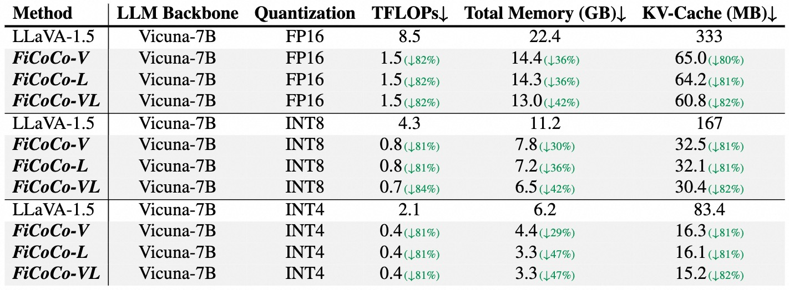

<div align="center">

<h1> Filter, Correlate, Compress:
Training-Free Token Reduction for MLLM Acceleration </h1>

<h4 align="center"> 

[Yuhang Han](https://scholar.google.com/citations?user=zggQZNAAAAAJ)<sup>1* </sup>,
[Xuyang Liu](https://xuyang-liu16.github.io/)<sup>2*</sup>,
Zihan Zhang<sup>3</sup>,
[Pengxiang Ding](https://dingpx.github.io/)<sup>4</sup>,
[Donglin Wang](https://milab.westlake.edu.cn/)<sup>4</sup>,\
[Honggang Chen](https://sites.google.com/view/honggangchen/)<sup>2</sup>,
[Qingsen Yan](https://qingsenyangit.github.io/)<sup>1</sup>,
[Siteng Huang](https://kyonhuang.top/)<sup>5✉</sup>

<sup>1</sup>Northwestern Polytechnical University, <sup>2</sup>Sichuan University,\
<sup>3</sup>ohns Hopkins University, <sup>4</sup>Westlake University, <sup>5</sup>Zhejiang University

<p>
<a href='https://arxiv.org/pdf/2411.17686'></a>
<a href='https://ficoco-accelerate.github.io/'></a>

</h4>
</div>

<p align='center'>

</p>

## 🔥 News

* **`2025.01.10`** 🤗🤗 We release our latest work [GlobalCom<sup>2</sup>](https://arxiv.org/abs/2501.05179), a "global-to-local" approach for training-free acceleration of **high-resolution MLLMs**. [Code](https://github.com/xuyang-liu16/GlobalCom2) is available!
* **`2024.11.17`** 🤗🤗 We release our work [FiCoCo](https://ficoco-accelerate.github.io/) which proposes a **unified paradigm** to demystify the popular works and guide the future designs of training-free token reduction for MLLMs.


## 👀 Overview

<div align=center>

</div>

> **TLDR:** This study introduces a unified "filter-correlate-compress" paradigm to streamline training-free token reduction in Multimodal Large Language Models (MLLMs), achieving up to 82.4% FLOPs reduction with minimal performance impact and outperforming existing methods across 10 benchmarks.

## 🛠 Preparation

1. Clone this repository.
```bash
git clone https://github.com/kawhiiiileo/FiCoCo.git
cd FiCoCo
```

2. Environment Setup and Preparation
```Shell
 conda create -n FiCoCo python=3.10 -y
 conda activate FiCoCo
 pip install -e .
```

3. Download Multimodal Benchmark

Please follow the detailed instruction in [LLaVA-Evaluation](https://github.com/haotian-liu/LLaVA/blob/main/docs/Evaluation.md).

4. Download [LLaVA](https://huggingface.co/liuhaotian/llava-v1.5-7b) and put them under `./liuhaotian/llava-v1.5-7b`.


## 🚀 Run and Evaluation
To configure the FiCoCo model with these parameters, update the corresponding settings in your code or configuration file. Below is an example configuration:

For example:\
`merge_visual: true`       # Enable FiCoCo-V for visual tokens compression\
`AT: true`                 # Enable FiCoCo-L for visual tokens compression\
`r: 42`                    # Compress 42 tokens per layer\
`control_encoding_layer: 11`  # Start compression from the 12th transformer layer

Example for evaluating SQA results (r=42, control_encoding_layer=11, merge_visual=True):
```Shell
CUDA_VISIBLE_DEVICES=0 bash scripts/v1_5/eval/sqa.sh
```

<p align="center">  </p>

> To calculate the theoretical computational efficiency shown above, we recommend the methodology presented in the work of [LLM-Viewer](https://github.com/hahnyuan/LLM-Viewer/). We deeply appreciate their outstanding contribution to this field.


## 📌 Citation

If you use FiCoCo in your research, please cite our work by using the following BibTeX entry:
```bibtex
@article{FiCoCo2024,
    title={Rethinking Token Reduction in MLLMs: Towards a Unified Paradigm for Training-Free Acceleration}, 
    author={Yuhang Han and Xuyang Liu and Pengxiang Ding and Donglin Wang and Honggang Chen and Qingsen Yan and Siteng Huang},
    year={2024},
    eprint={2411.17686},
    archivePrefix={arXiv},
    primaryClass={cs.CV}
}

```
## 👍 Acknowledgment

We extend our gratitude to the open-source efforts of [LLaVA](https://github.com/haotian-liu/LLaVA), [ToMe](https://github.com/facebookresearch/ToMe/) and [Open-LLaVA-NeXT](https://github.com/xiaoachen98/Open-LLaVA-NeXT).

## :e-mail: Contact
For any question about our paper or code, please email `yuhangh984@gmail.com` or `liuxuyang@stu.scu.edu.cn`.
